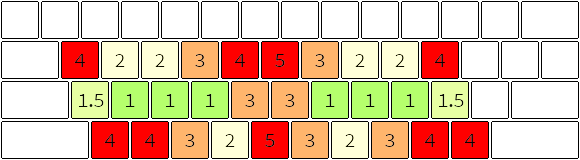
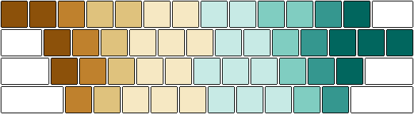
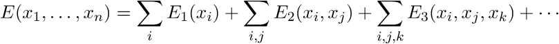
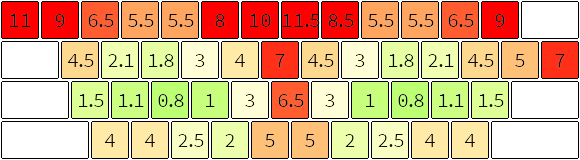
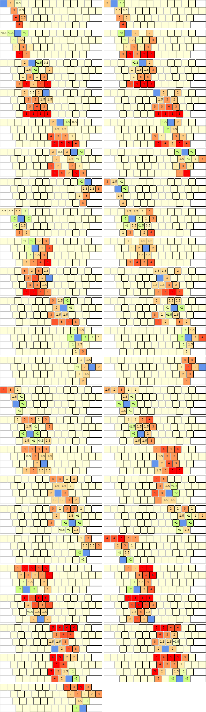
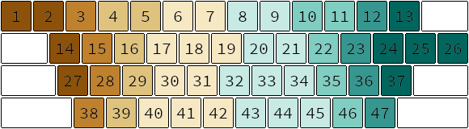

## What is the best keyboard layout?

Often in our thinking we arrive at questions like this that have no real answer, and assuming that they do have an answer generally leads to wasted effort. The word "best" has no meaning without a context; "best" under what circumstances? As we learn from mathematics, the way you define a problem is as important as the answer itself. You state your axioms, and from there you can use mathematical methods to see what result those axioms imply.

To most people, keyboard layouts should be evaluated based upon efficiency. We want to use the layout that requires the least amount of effort to do what we want to do with a keyboard. Well, that sentence alone has several ambiguities in it. Not every person will be typing text with the same distribution of letters and numbers and punctuation. Programmers will type differently than transcribers, who will type differently than accountants. Also, "effort" is surprisingly hard to define when it comes to typing. There are many different metrics, such as finger travel distance, same hand utilization, same finger utilization, and even similarity to QWERTY. All of these considerations and more have to be combined somehow into one measure of efficiency, which we call an **objective function**.

So, to sum up, the real question at hand is really two questions.

1. Which objective function represents my preferences?
2. Which layout is the best as measured by that function?

We will explore how these questions are answered by some of the layouts developed so far.

## The problems with existing layouts

### QWERTY (1873)

The objective function informally used in designing QWERTY is how well it can stop typewriters from jamming, while still being relatively efficient. Whether it is actually an optimal layout for this is debatable. As far as anyone can tell, the designer of QWERTY, Christopher Latham Sholes, a newspaper editor and printer from Milwaukee, took the letters of the alphabet, placed them in two rows, moved all the vowels into a new row above that, and then messed with this layout until it was good enough to stop jamming.

Even the physical design of keyboards today is based on the mechanical constraints of the original typewriter. The keys are staggered in that strange way to allow space underneath the keys for the metal levers suspending them. There are grid keyboards today which ignore this obsolete constraint, but they are not popular because they are nonstandard.

Similarly, alternative keyboard layouts besides QWERTY are not popular because they are nonstandard, a consequence of the network effect.

### Dvorak (1936)

Dr. August Dvorak was a professor of education at the University of Washington. He designed a keyboard layout with finger travel distance, letter frequency, bigram frequency (a bigram is a combination of two letters, like "th" or "st"), and same hand utilization in mind. So what's wrong with that?

* Minimizing same hand utilization (how often you consecutively type letters using the same hand) is only important for keyboards where the keys are difficult to press, like with mechanical typewriters. The large force required to push a key down, coupled with the large distance a key needed to travel in order to count as completely down, made it very difficult to press two keys in rapid succession on the same hand. But on modern keyboards, it's actually much faster to use the same hand movement to press several keys in quick succession, especially if they are using adjacent fingers. Therefore, in layouts designed for modern keyboards, we want same hand utilization to be high, not low.
* Finger travel distance is not the most important metric. A fingertip does not require the same amount of effort to move in any direction or over any distance. Also, fingers differ in strength. This will be explored further in the discussion of the Workman layout below.
* Since vowels make up the left side of the home row, the right hand is used much more than the left because English uses more consonants than vowels.
* The L key requires the right pinky to stretch too often.
* The I key is not a home position key, though it should be, according to the letter frequency of most bodies of English text.
* Square and curly brackets are even harder to type than in QWERTY, which hurts programmers. There is a modified version called Programmer's Dvorak that makes it easier, but it moves the numbers so that they require holding shift, and brackets and parentheses are still harder than they need to be.

### Colemak (2006)

Created by Shai Coleman as an answer to Dvorak, this layout seeks to be easier to learn for people that already know QWERTY by keeping many of the same letter placements. This also serves to preserve many of the most common keyboard shortcuts like those used for undo (Z), cut (X), copy (C), paste (V), select all (A), quit (Q), and close window (W). It also replaces the caps lock key with a backspace key, because CAPS LOCK IS VERY RARELY USED and backspace is used constantly. Other than that, Colemak has many of the same design goals as Dvorak, such as minimizing finger travel distance and having high hand alternation. It also purports to have lower same finger utilization. Here are my criticisms:

* As explained above for Dvorak, minimizing same hand utilization and finger travel distance are not the most important metrics.
* Similarity to QWERTY for ease of learning is not important to me. I'm hopefully going to be using a keyboard for the rest of my life, so the learning time is a relatively small investment.
* Preserving only some QWERTY shortcuts is actually a bad thing. Keyboard shortcuts are extremely helpful, and I try to use as many as possible. Remembering which ones are still QWERTY and which are not is very error prone. This is particularly bad when compared with the better alternative: having your layout temporarily switch to QWERTY when a meta-key (control, alt, option, command, etc) is held down. For me, using a keyboard shortcut is mostly down to muscle memory, as is touch-typing, but they're stored separately in my mind. I usually have the mouse in my right hand and, on Windows or Linux, I use my left pinky to hold down the control key while hitting a letter key with my left index finger. (On Mac, the only difference is that I use my thumb to hold down the command key). So there you have it: all QWERTY shortcuts preserved and no sacrifice in key positioning for regular typing.
* Typing "the", probably the most common word in the English language, requires stretching the right index finger to the left to hit "H" while keeping the right middle finger back to hit "E". This is too much work for such a common word, in my opinion.

### Workman (2010)

This layout was developed by a programmer, OJ Bucao, as part of his plan to deal with repetitive strain injury (RSI), along with switching to a grid-type keyboard, with the keys in straight columns. One insight that came with the design of this layout is that finger travel distance is not an important metric. Each finger has a different range of motion and overall strength. The index finger is short and strong; the middle finger, long and strong; the ring finger, long and weak; and the pinky finger, short and weak. Short fingers don't like to stretch to the top row, whereas long fingers don't like to curl to reach the bottom row. Strong fingers should do more work than weak ones. And in general, fingers move vertically (via extending or curling) faster than they do horizontally.

He codified this design concept by creating a customized key score for each key press (shown above). Combining this key scoring procedure with a choice of input text will create an objective function, but the Workman layout has other goals as well. It strives to maintain common QWERTY shortcuts, to work well on common bigrams, to use both hands about equally, and to have high same hand utilization. My relatively minor problems with this layout are

* There are logical inconsistencies in the key cap scores, due to the fact that it is originally designed for a grid-type keyboard. If you look at the two keys directly below the left index finger's home row key, you'll see that one is scored 3 and the other 2. This signifies that it's easier to move the index finger away from the hand when moving down. But on the right hand, the scores are not mirrored. Moving the right index finger away from the hand is scored higher than  moving it toward the hand.
* The scores should reflect that the middle finger is stronger and more coordinated than the ring finger.
* There are no scores for the keys with numbers and symbols.
* As previously mentioned, preserving only some QWERTY shortcuts is a bad thing, in my opinion.
* The home keys are still in the same place as the ASDF and JKL; keys in QWERTY. If we're going to go to the trouble of changing from the standard layout, we might as well get rid of as many unnecessary constraints as possible, including where we put our hands on the keyboard. Sliding the right hand one key right allows the right pinky to be assigned to almost half as many keys as before. If I'm going to be reaching for a key, I prefer to use my strong index finger instead of my weak pinky. Plus, the right pinky is already responsible for the enter and shift keys (also the backspace key in most layouts). Another minor reason for shifting the right hand one key right is that it's pleasingly symmetric. The enter and caps lock keys will now be adjacent to your pinkies. On most laptops, your hands will now be equidistant from both edges.
* Another unnecessary constraint is keeping the same key pairings as used by QWERTY. For example, the comma key is still paired with the left angle bracket key, in what I consider to be prime real estate space, while the left parenthesis is stuck off in the boonies, in the top row behind behind the 9.

## Why a new layout?

I've explained my criticisms of some of the design decisions and metrics emphasized by existing layouts, but I also generally object to the idea that we should all use the same layout. If you use a computer almost every day, the amount of time you spend typing in your life will be much greater than the amount of time you spend learning to type using a new layout.

My preferences derive from the fact that I split my time between scientific writing and programming, and so the choice of input text used in evaluating the objective function should reflect that. I'm not going to be typing out all of "Alice in Wonderland" anytime soon. I'm mainly going to be writing emails, IMs, research papers, and code.

Another important point is that the amount of time I spend on a computer where I can customize the keyboard layout is much, much larger than the time I spend using a computer without a customizable layout. I am willing to fall back on QWERTY for those rare cases.

Lastly, I just find optimization problems like this fascinating, and I have a few new ideas to try out.

1. Move the right hand home position one key to the right, as shown in the finger assignment diagram below.
2. Only assume that lower-case letters should be paired with their upper-case letters; any other pairing of characters (the numbers and punctuation) to form a key should be permissible.
3. Use all of the text I've typed over the last 5 years as the input text for the objective function. This is a good method of predicting what distribution of characters I will type in the future.
4. Generalize the idea of custom single key scores (from Workman) and create custom scores for double and triple consecutive key presses as well.

### The multibody expansion

That last list item is closely related to an idea from physics called the multibody expansion, which finds use in molecular simulations. The energy of large groups of particles is often very complicated and hard to calculate, due to quantum mechanics, but in many simulations it is simplified and written as a sums of different types of energies: one for single particles, one for for pair interactions, one for 3-body interactions, etc. The single particle energy can represent a background potential field. The pair interaction often represents attraction or repulsion between pairs of particles based on the distance between them. The 3-body interaction can be used to characterize bond angles in molecules.

Similarly, when evaluating the cost of typing a word in a given layout, I want to break down that cost into a sum of single key scores, double key scores, and triples key scores. I am stopping at 3 mostly because there are already 97,290 triple key scores, and moving to quadruple key scores would require 4,280,760 more scores (though admittedly most of them are zero).

## The new objective function

The objective function for this new layout is based on a linear combination of the following scores:

1. A score for each single key press (similar to that used in designing the Workman layout).
2. A score for each two consecutive key presses, signifying the difficulty of the transition.
3. A score for each three consecutive key presses, signifying the difficulty of the transition.
4. A small penalty score for pressing consecutive keys with different hands.
5. A small penalty score for having to hold shift while pressing a key.

This scoring method is then evaluated on a collection of text that is representative of all text I've typed in the last four years, which produces a number representing the objective function. Specifically, I take all of my code, IMs, emails, and articles over that time period, remove any non-ASCII characters, and create a long word frequency list to be used in scoring layouts. Lastly I throw out any words that were not used more than 20 times over 4 years, for the sake of efficiency.

### Single key scores

The single key scores shown below are a modified version of the scoring system developed for the Workman layout. It addresses my concerns with symmetry and logical consistency and adds scores for all keys in the layout.

### Double key scores

The scores for consecutive pairs of keys are shown below. Each layout diagram shows the score associated with pressing the blue key and then subsequently pressing any other key in the diagram. Keys without a score shown have a score of 0. Finger assignments are indicated by alternating key borders of light grey and black.

Despite the apparent randomness in the scores, they follow several general principles.

* The transition score between two keys that are not assigned to adjacent fingers is 0.
* A horizontally adjacent key that is assigned to an adjacent finger on the same hand is given -2, with the exception of horizontal transitions between the middle and index finger or the ring and pinky finger that happen in the top two rows, which are given -1, and -2 is given to diagonal transitions that better favor the relative positioning of the fingers.

### Triple key scores

The triple scores follow similar general principles.

* The transition score for three keys that are not all three assigned to adjacent fingers is 0.
* Horizontally adjacent keys that are assigned to an adjacent finger on the same hand are given -2, with the same exceptions as with the double key scores, to accommodate the inability of the pinky and index fingers to reach the top rows easily.

We assign a number to each key, according to the following diagram.

The triple key scores are then written as a series of 3 key numbers followed by their score.

|    keys    | score |    keys    | score |    keys    | score |    keys    | score |
|-----------:|:------|-----------:|:------|-----------:|:------|-----------:|:------|
|  1,  3,  4 |  -0.5 |  3,  5, 17 |  -1.0 | 12, 10,  9 |  -1.0 | 47, 46, 44 |  -0.5 |
|  2,  3,  4 |  -1.0 | 15, 16, 17 |  -2.0 | 12, 11, 21 |  -1.5 | 13, 12, 11 |  -1.0 |
|  2,  3,  5 |  -0.5 | 15, 16, 18 |  -1.0 | 12, 10, 21 |  -1.0 | 13, 12, 10 |  -0.5 |
| 14,  3,  4 |  -1.5 | 15, 16, 30 |  -1.5 | 23, 22, 21 |  -2.0 | 24, 12, 11 |  -1.5 |
| 14,  3,  5 |  -1.0 | 28, 29, 30 |  -2.5 | 23, 22, 20 |  -1.0 | 24, 12, 10 |  -1.0 |
| 14, 15, 16 |  -2.0 | 28, 29, 31 |  -1.0 | 23, 22, 34 |  -1.5 | 24, 23, 22 |  -2.0 |
| 27, 15, 16 |  -1.5 | 28, 29, 40 |  -1.5 | 36, 35, 34 |  -2.5 | 25, 12, 11 |  -1.5 |
| 27, 28, 29 |  -2.0 | 28, 29, 41 |  -1.5 | 36, 35, 33 |  -1.0 | 25, 12, 10 |  -0.5 |
| 27, 28, 30 |  -0.5 | 28, 16, 30 |  -1.0 | 36, 35, 45 |  -1.5 | 25, 23, 22 |  -1.0 |
| 27, 29, 30 |  -0.5 | 28, 16, 17 |  -0.5 | 36, 35, 44 |  -1.5 | 37, 36, 35 |  -2.0 |
|  3,  4,  6 |  -1.0 | 38, 39, 40 |  -2.0 | 36, 22, 34 |  -1.0 | 37, 23, 22 |  -1.5 |
|  3,  5,  6 |  -1.0 | 38, 39, 41 |  -0.5 | 36, 22, 21 |  -0.5 | 37, 35, 34 |  -0.5 |
|  3,  4, 17 |  -1.5 | 12, 11,  9 |  -1.0 | 47, 46, 45 |  -2.0 | 37, 36, 34 |  -0.5 |

Also, note that every triple is written as an inward roll, moving towards the center of the keyboard with each successive key. Since I prefer inward rolls, I use the same scores as above for outward rolls but I add in a small penalty, which I refer to as the "reversed triple penalty" below.

### Parameters

As previous mentioned, the objective function I will use in designing this new layout is made of a linear combination of the single, double, and triple key scores from the previous sections, as well as a shift-holding penalty (added each time you have to hold shift while pressing another key) and a hand-alternation penalty (added each time you alternate hands while typing a word). These parameters must be chosen, and ideally they'd be based on actual timing data from my typing.

So I collected timings between all key presses as an experiment to see how well I could make the objective function score match the timings by tuning the aforementioned parameters, but I ran into a problem. The timings were collected while using the QWERTY layout, so certain keys that form common sequences, such as "ing", always come out faster because I have trained my brain to anticipate them and speed them up in the QWERTY setting. The key scores are supposed to be layout agnostic; they assign scores to combinations of keys that don't depend on which layout is being used, so in future iterations of this work I will have to figure out a strategy to decorrelate the data so that I can have a better basis for choosing the parameters.

Until then, I have performed an informal parameter study and chosen the following parameters based on which optimal layouts are produced with the resulting objective function.

| score type               | coefficient |
|--------------------------|-------------|
| single score             | 1.00        |
| double score             | 1.00        |
| triple score             | 1.00        |
| shift-holding penalty    | 1.50        |
| reversed triple penalty  | 0.25        |
| hand-alternation penalty | 0.20        |

## Finding the optimal layout

In order to find the optimal layout for a given objective function, I wrote a program in the [Rust programming language](http://rust-lang.org) that uses a combination of [simulated annealing](http://en.wikipedia.org/wiki/Simulated_annealing) and [tabu search](http://en.wikipedia.org/wiki/Tabu_search). The code is included in this repository so that you too can design your own custom keyboard layout using your own collected works as the text corpus. Just remove or replace any non-ASCII characters in the texts and place them as .txt files in the "texts" directory and type "cargo run --release" to search for an optimal layout.

The layout I originally found using the above parameters is shown below.

There are a few things to point out. I have forced the numbers to be in the positions they are, purely based on taste. If I didn't constrain them, then they would have been strewn about the layout in a way that helps optimize the objective function more, but I prefer them to be in order on the top row for the sake of memory, organization, and learning. The split between 5 and 6 is necessary because I have moved the right hand over one whole key to the right, relative to where it is in QWERTY, so hitting the 6 would have been much harder had they been kept the same.

For the same reasons that I want the numbers to be order, I want matching punctuation (parentheses, curly brackets, square brackets, and angle brackets) to be next to each other. So based on the previous layout, I looked at their prevalence in the text corpus, compared to other punctuation, and placed them in a way that is relatively optimal. I then forced them to stay where they are and re-ran the optimization program to get the final layout. I made some other minor adjustments, such as pairing '-' and '+'', since that only involved swapping '-' and '_', which have almost the same frequency in the text corpus.

## The White keyboard layout

I'm not good at naming things. Plus, I figure that my last name, White, is so common both as a last name and as an English word that it barely counts as being eponymous. Here's the final layout.

Note that this layout still acts like QWERTY for the purposes of keyboard shortcuts, as discussed above. Also, I have re-mapped my caps lock key to backspace.

### Installation

To use the layout on Mac OS X, download the file named "White_layout_mac.keylayout" from this repository and place it in the /Library/Keyboard Layouts/ folder. Then selected it in system preferences.

To use the layout on Windows 7 (other versions not confirmed), download the file named "White_layout_win.zip", extract it, and run setup.exe. It will automatically install the correct DLL in the correct place. Or if you don't trust a precompiled version, you can download [the Microsoft Keyboard Layout Creator](https://msdn.microsoft.com/en-us/goglobal/bb964665.aspx), open the file "White_layout_win.klc" (which is just a plain text description of the layout that you can verify), and compile it for your system.

To use the layout on any other operating system, make it yourself, send it to me, and I'll update this for your system.
